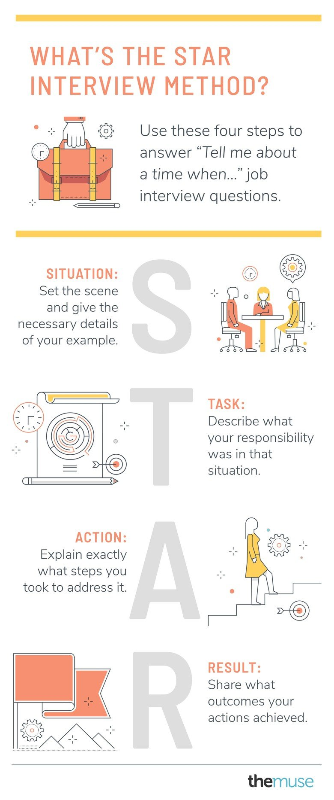

# Brag Diary Presentations in Buddy Groups

Each week you will be taking turns to present an entry from your Brag Diary.

In order to make this useful we would like you to use the STAR method.&#x20;

You will be practicing just how you would answer in a real interview situation.

#### What is the STAR method?&#x20;

* helps you answer behavioural interview questions in a simple and meaningful way
* Behavioural interview questions are looking for you to give a real life example of how you managed a particular kind of situation in the past.&#x20;
* The acronym STAR stands for:
  * **S**ituation: Set the scene and give the necessary details of your example.\
    **T**ask: Describe what your responsibility was in that situation.\
    **A**ction: Explain exactly what steps you took to address it.\
    **R**esult: Share what outcomes your actions achieved.
* Keep it simple and focus on just one or two sentences for each letter of the acronym.

#### How do you use the STAR method?&#x20;

1. Choose your example
   1. You need to choose an example to talk about
   2. This will be the situation you choose for the week to show your success&#x20;
   3. As time goes on you will get better at choosing examples that really highlight your achievement
2. Next you will set the scene **(S)**
   1. Clearly describe the situation you were in and highlight the challenge&#x20;
   2. Keep things short and focus only on what is relevant to your story
3. Then move on to the task **(T)**
   1. Specifically describe what was the objective set for you and what your responsibilities were in that particular scenario
4. Now you can share what action you took** (A)**
   1. Describe what steps you took solve a problem or reach a goal
   2. Be specific - Did you work with another person or team? Did you use a particular piece of software or technology? Did you form a detailed plan?
5.  Finally close your story with the result you achieved **(R)**

    1. Share the results of the action you took, what you learned or the steps you took to improve.
    2. This should be positive!&#x20;

#### Putting it All Together - STAR story

**Competency:** Time Mangement; Problem Solving;&#x20;

**Example:**

**Situation:** _“In my previous sales role, I was put in charge of the transfer to an entirely new customer relationship management (CRM) system—on top of handling my daily sales calls and responsibilities.”_

**Task:** _“The goal was to have the migration to the new CRM database completed by Q3, without letting any of my own sales numbers slip below my targets.”_

**Action:** _“In order to do that, I had to be very careful about how I managed all of my time. So, I blocked off an hour each day on my calendar to dedicate solely to the CRM migration. During that time, I worked on transferring the data, as well as cleaning out old contacts and updating outdated information. Doing this gave me enough time to chip away at that project, while still handling my normal tasks.”_

**Result:** _“As a result, the transfer was completed two weeks ahead of deadline and I finished the quarter 10% ahead of my sales goal.”_\
\

&#x20;

