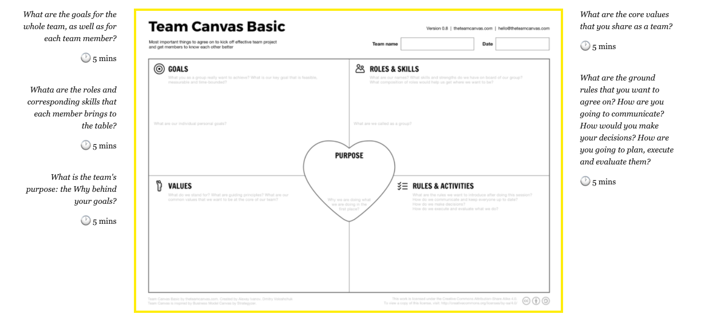

# Break Into Project Teams - Start Team Canvas

Team Canvas comes in two flavors. Team Canvas Basic is a simple template to kick-off a team project, adjust its course and ensure the team has enough momentum to get things done smoothly. It takes about 25-30 minutes to finish.

