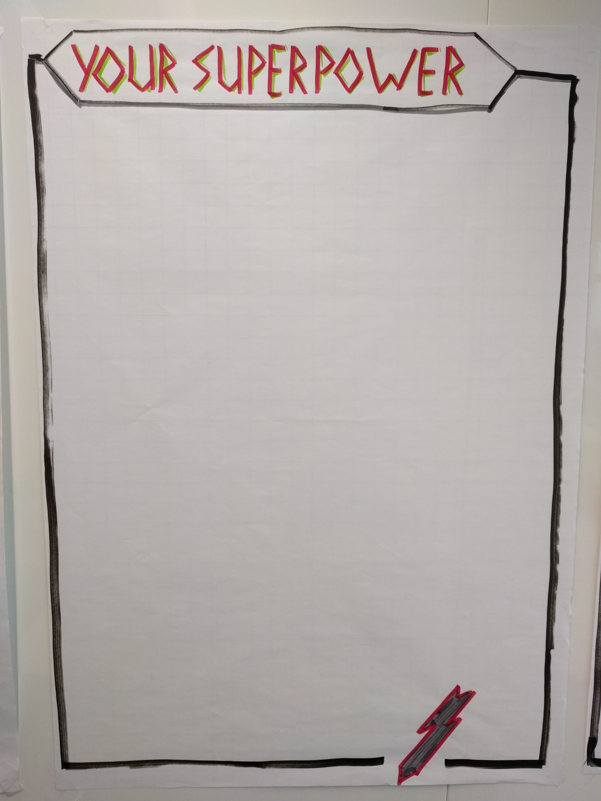
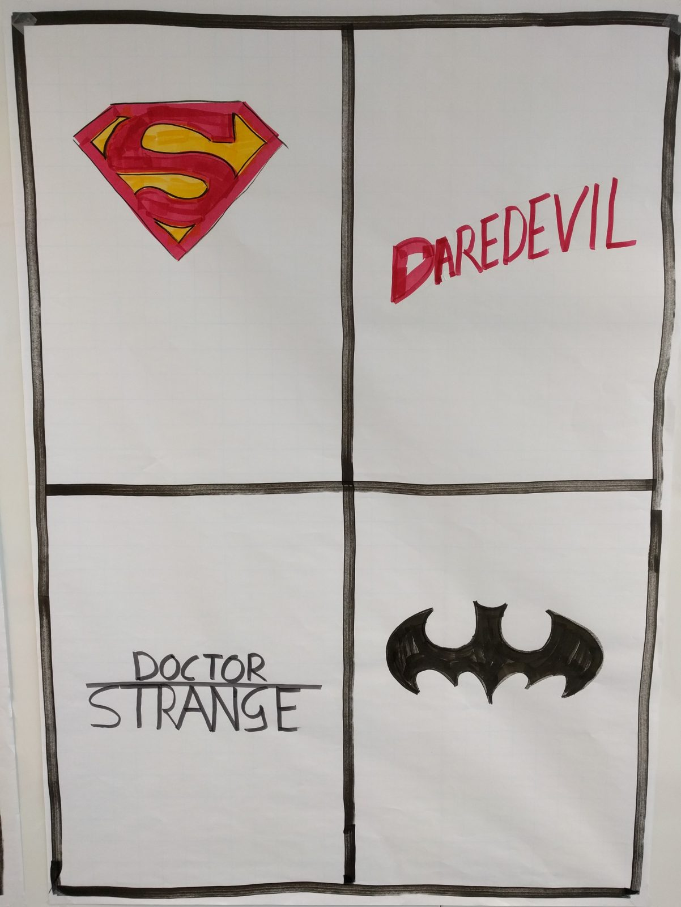
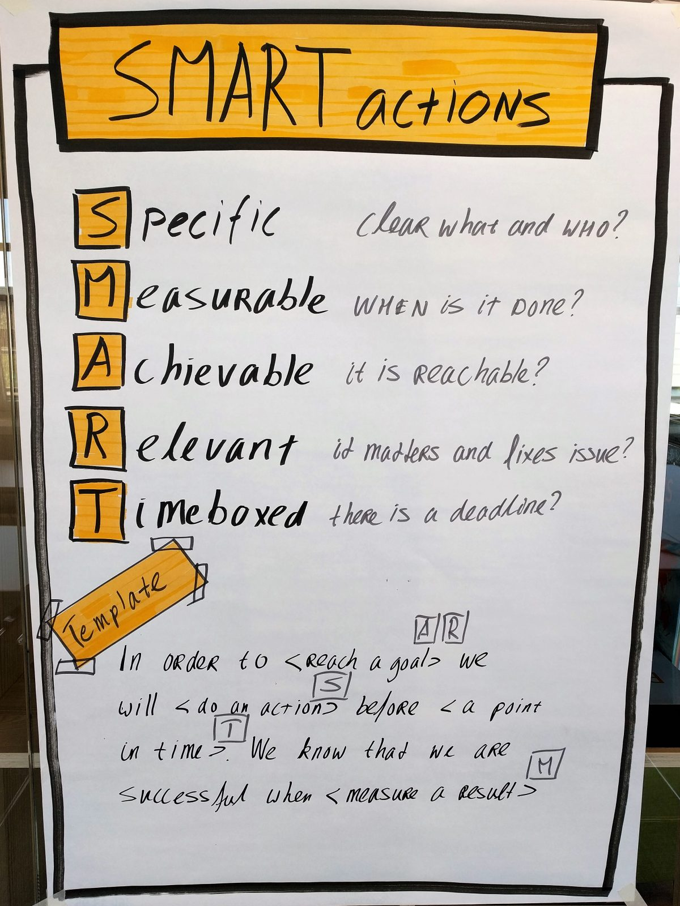
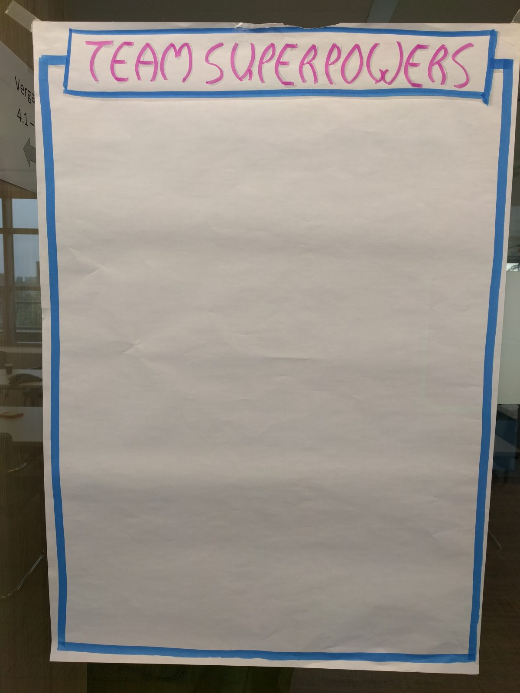

# Retro - What's your Superpower?

In the book [Agile Retrospectives: Making Good Teams Great](https://www.amazon.com/Agile-Retrospectives-Making-Teams-Great/dp/0977616649) by Diana Larsen and Esther Derby, the authors explain a retrospective as having the following steps:

* **Set the Stage**: make sure everyone feels safe and is involved in the retro
* **Gather The Data**: what happened, make sure everyone has the same picture
* **Generate Insights**: analyze the data to find root causes
* **Decide What To Do**: what are experiments that could help us to improve [1% a day](https://agilestrides.com/blog/113-practices-of-extreme-programming-applied-to-management/)
* **Closing**: close the retro with an activity

Remeber that your retro is covering the past 4 weeks and should keep the focus on their soft skill development including teamwork, communication, 

### **Step 1 - Set the Stage**: \(Use online whiteboard like Miro, or Google Jamboard to post answers\)

  
**Your Superpower** 

  
Using Superheroes as a theme for your retro, ask the question:  
  
What is your superpower?   
What skill or competence do you bring with you to the group?  
  
Ask participants to write their superpower on a sticky note or text box and explain why they chose that particular trait or skill.  

### **Step 2 - Gather the Data: \(**You can use an online retro board for this like [Metro Retro](https://metroretro.io) or [Easyretro](https://easyretro.io/publicboard/hWBjp6dsAwfq8IR3trAaYhDCcmJ3/4b2b3322-96af-4861-b900-15aad60cc3b6)\)

  
  
**Superhero** \(This is basically the same activity as for example Liked, Learned, Longed For, but by using different terms and images to challenge participants and keep it fun.\)   
  
Also you can use different Superhero names which are not cis white men!  
  
  
What do you think was super ?   
  
What do you think was strange?   
  
What do you think was bad?   
  
What didn’t you dare to do? What was scary?   

Ask participants to write their answers to the following questions on a sticky note or text box.    
Have them talk about the Super and Strange things they wrote down. Leave the Bad and Scary things to discuss in the next step. 

### **Step 3 - Generate Insights**: \(Use the same Metro Retro or Easyretro board\) 

Using the data gathered in Step 2, discuss what were the causes for why things were bad and why things were scary..   
Why did they go wrong? 

Why were you afraid to try something?   
  
Invite participants to write their answers in the Write your answers on the retro board.   

### **Step 4 - Decide what to do**:  **SMART Actions \(Use whiteboard Miro or Jamboard\)**  

Use this activity to help the group define their actions for the next module. 

In this case, you can use this template to help the team define SMART actions. 

It's also a practical way for trainees to learn about SMART goal setting.

  
**Template:**  
In order to &lt;reach our goal&gt; we will &lt;do an action&gt; before &lt;a point in time&gt;. We will know we are successful when &lt;measure of the result happens&gt;. 

**Closing:** 

  
**Team Super Powers**

As a positive closing of the retrospective,

Ask the group to write down what they think is the superpower of the team. 

